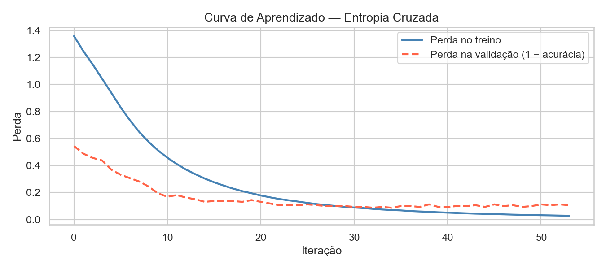
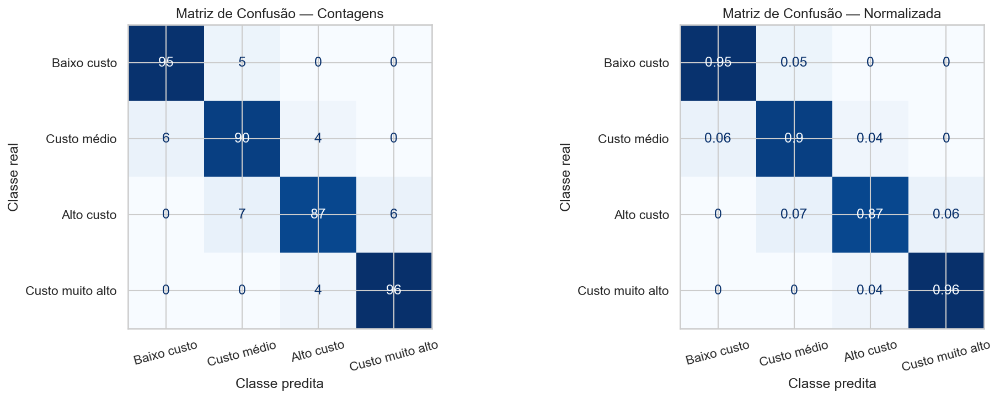
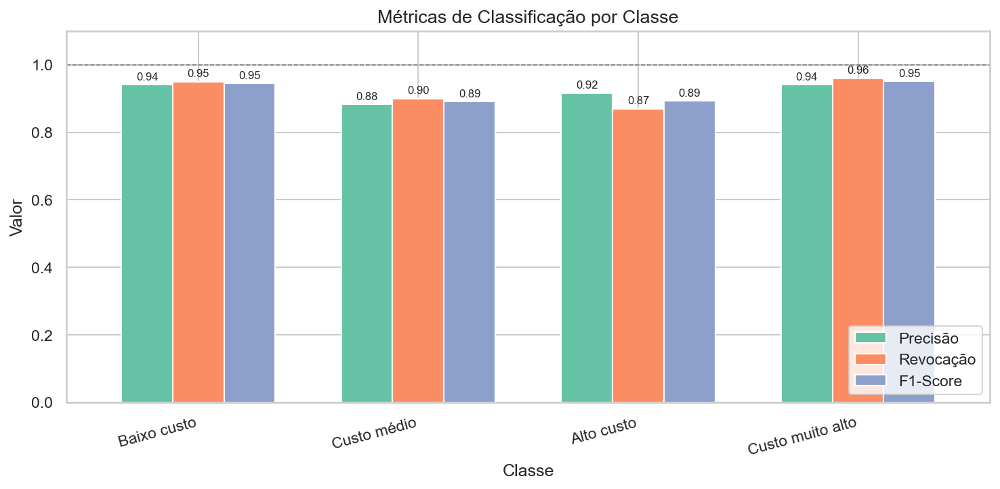
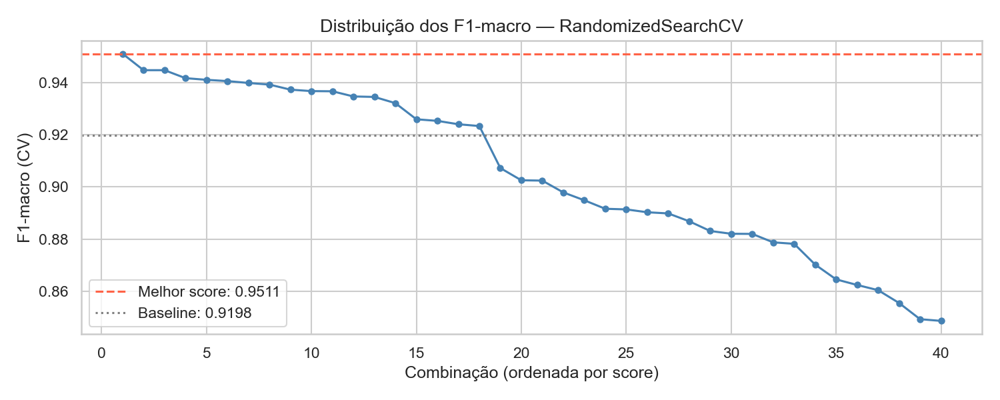
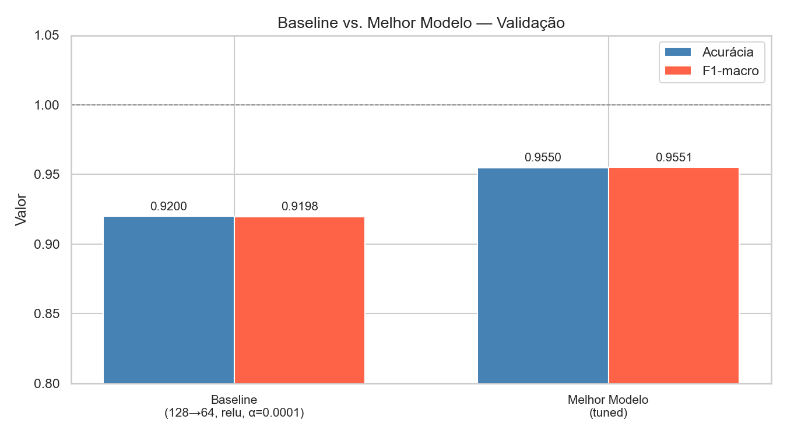
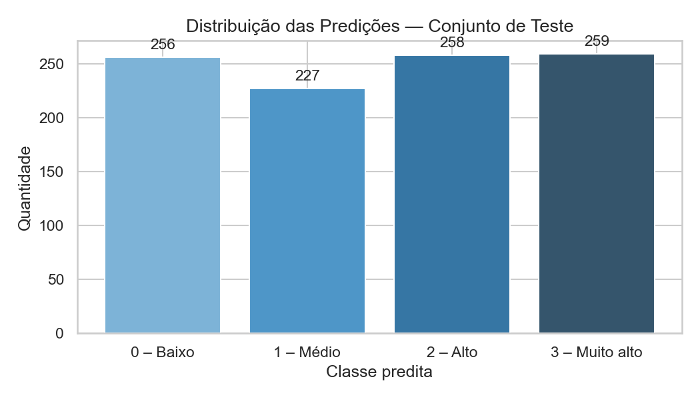
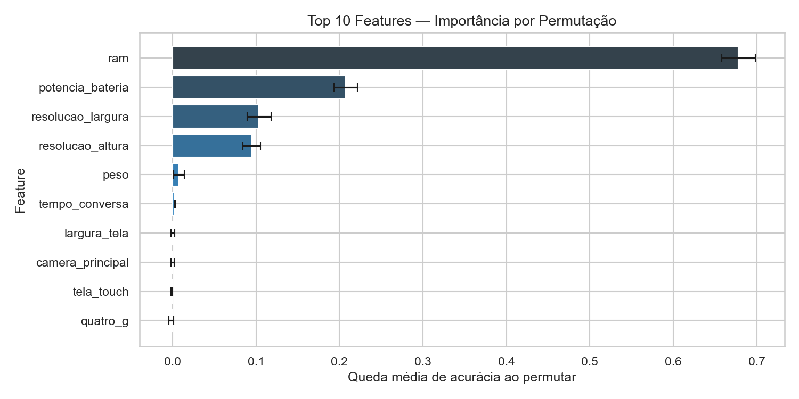

# MobileNet — Mobile Price Range Classification

Classificação de faixa de preço de celulares com rede neural MLP.

---

## Tecnologias


---

## Problema

Dado um conjunto de especificações técnicas de dispositivos móveis, o objetivo é prever a faixa de preço (`faixa_preco`) em quatro categorias:

| Classe | Descrição        |
|--------|------------------|
| 0      | Baixo custo      |
| 1      | Custo médio      |
| 2      | Alto custo       |
| 3      | Custo muito alto |

---

## Dataset

| Arquivo          | Descrição                                |
|------------------|------------------------------------------|
| `data/train.csv` | 2000 amostras com rótulo `faixa_preco`   |
| `data/test.csv`  | Amostras para predição                   |

> Os arquivos de dados não são versionados. Adicione-os manualmente à pasta `data/`.

**Features disponíveis (20):** potência da bateria, RAM, câmeras frontal e principal, memória interna, profundidade, peso, número de núcleos, resolução da tela, tamanho da tela, tempo de conversa e conectividade (Bluetooth, 4G, 3G, Wi-Fi, dual SIM, tela touch).

---

## Estrutura do Projeto

```
MobileNet/
├── data/
│   ├── train.csv               # não versionado
│   └── test.csv                # não versionado
├── images/
│   ├── eda/                    # etapa 1 — análise exploratória
│   ├── training/               # etapa 2 — curvas de aprendizado
│   └── evaluation/             # etapas 3-5 — métricas e resultados
├── notebooks/
│   ├── 01_data_treatment.ipynb
│   ├── 02_mlp_implementation.ipynb
│   └── 03_evaluation.ipynb
├── requirements.txt
├── .gitignore
└── README.md
```

---

## Configuração

```bash
python3 -m venv venv
source venv/bin/activate
pip install -r requirements.txt
jupyter notebook
```

---

## Análise Exploratória (EDA)

**Distribuição da variável alvo**


> O dataset é perfeitamente balanceado: cada uma das 4 classes possui exatamente 500 amostras (25% do total). Isso elimina o risco de viés do modelo em favor de classes majoritárias e torna a acurácia uma métrica confiável para avaliação.

**Mapa de correlação de Pearson**


> A **RAM** é a feature mais correlacionada com `faixa_preco` (r ≈ 0,92), seguida de `potencia_bateria`, `resolucao_largura` e `resolucao_altura`. A maioria das features não apresenta alta correlação entre si, o que indica baixa multicolinearidade e que cada variável contribui com informação independente ao modelo.

**Distribuição das top features por classe**


> - **RAM (MB):** feature com maior poder discriminativo — as medianas por classe são claramente separadas (~750, ~1600, ~2600, ~3500 MB), com mínima sobreposição entre classes adjacentes.
> - **Potência Bateria e Resolução:** apresentam tendência crescente da classe 0 para a 3, mas com sobreposição considerável entre classes, sendo features de suporte ao modelo.
> - **Memória Interna e Largura da Tela:** distribuições muito similares entre as 4 classes, indicando baixo poder discriminativo isolado — contribuem marginalmente para a classificação.

---

## Treinamento

**Curva de aprendizado — Entropia Cruzada**



> Ambas as curvas convergem rapidamente nas primeiras 10 iterações. A perda de treino chega próximo de zero (~0,03), enquanto a de validação estabiliza em torno de 0,12 — um gap esperado e dentro de um nível aceitável de overfitting. O *early stopping* interrompeu o treinamento em ~53 iterações sem melhora na validação, evitando sobreajuste adicional.

---

## Avaliação do Modelo

**Matriz de confusão**



> O modelo acertou 368 das 400 amostras de validação, atingindo **92% de acurácia**. Todos os erros ocorrem entre classes adjacentes (ex.: Custo médio confundido com Baixo ou Alto custo) — nenhum salto entre extremos (Baixo → Muito alto), o que indica que o modelo captura bem a ordem das faixas de preço. A classe **Alto custo** é a mais difícil, com 13 erros no total.

**Métricas de classificação por classe**



> As classes extremas (**Baixo custo** e **Custo muito alto**) obtiveram F1-Score de 0,95 — as mais fáceis de separar por terem apenas um vizinho de classe. As classes intermediárias (**Custo médio** e **Alto custo**) ficaram em 0,89, penalizadas pela ambiguidade natural entre faixas de preço próximas. O modelo apresenta desempenho consistente entre todas as classes, sem desequilíbrio relevante.

---

## Ajuste de Hiperparâmetros

**Distribuição dos scores — RandomizedSearchCV**



> Foram testadas 40 combinações aleatórias com validação cruzada de 3 folds. O melhor score (F1-macro = 0,9511) superou o baseline (0,9198) em todas as combinações do top-20. A busca confirmou que o espaço de hiperparâmetros explorado continha configurações significativamente melhores que o ponto de partida.

**Comparação: Baseline vs. Melhor Modelo**



> O ajuste de hiperparâmetros trouxe um ganho de **+3,5 p.p. em acurácia** (0,92 → 0,955) e **+3,53 p.p. em F1-macro** (0,9198 → 0,9551). A configuração vencedora foi:
>
> | Parâmetro            | Baseline   | Melhor Modelo |
> |----------------------|------------|---------------|
> | `hidden_layer_sizes` | (128, 64)  | (256, 128)    |
> | `activation`         | relu       | tanh          |
> | `alpha`              | 0,0001     | 0,1           |
> | `learning_rate_init` | 0,001      | 0,001         |
> | Acurácia (validação) | 92,00%     | **95,50%**    |
> | F1-macro (validação) | 91,98%     | **95,51%**    |

---

## Resultados Finais

**Distribuição das predições — Conjunto de Teste**



> O modelo de produção (treinado em 100% dos dados) gerou predições bastante equilibradas entre as classes: 256 (Baixo), 227 (Médio), 258 (Alto) e 259 (Muito alto). A distribuição próxima a 25% por classe é coerente com o dataset de treino perfeitamente balanceado, indicando que o modelo não tem viés sistemático em direção a nenhuma faixa.

**Importância das features por permutação**



> A **RAM** é de longe a feature mais crítica — embaralhá-la causa uma queda de ~68 p.p. de acurácia, o que confirma o que a correlação de Pearson já indicava. Em segundo lugar, **potência da bateria** (~21 p.p.), seguida de **resolução largura** e **resolução altura** (~10 p.p. cada). As demais 16 features têm importância próxima de zero individualmente, ou seja, o modelo consegue classificar bem com apenas 4 features dominando a decisão.

---

## Roadmap do Projeto

### [CONCLUÍDO] Etapa 1 — Tratamento de Dados
- Carregamento e inspeção dos CSVs
- EDA: tipos de dados, estatísticas descritivas, valores ausentes
- Distribuição da variável alvo
- Mapa de correlação de Pearson
- Boxplots das top features por classe
- Normalização com `StandardScaler`
- Divisão treino/validação (80/20, estratificada)

### [CONCLUÍDO] Etapa 2 — Implementação do MLP
- Definição da arquitetura (camadas, neurônios, funções de ativação)
- Treinamento com `MLPClassifier` do scikit-learn
- Curva de aprendizado (perda por época)

### [CONCLUÍDO] Etapa 3 — Avaliação do Modelo
- Acurácia no treino e na validação
- Matriz de confusão
- Relatório de classificação (precisão, revocação, F1-score por classe)

### [CONCLUÍDO] Etapa 4 — Ajuste de Hiperparâmetros
- Grid search ou random search
- Parâmetros: número de camadas, neurônios, taxa de aprendizado, regularização
- Comparação de resultados

### [CONCLUÍDO] Etapa 5 — Resultados Finais
- Seleção do melhor modelo
- Predição no conjunto de teste
- Análise de erros e conclusões
