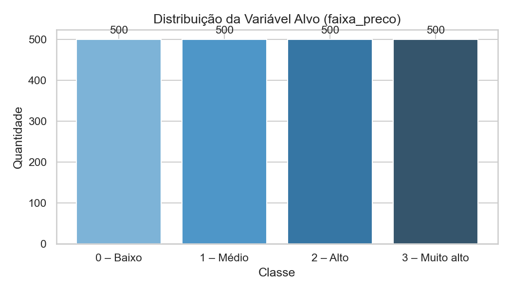
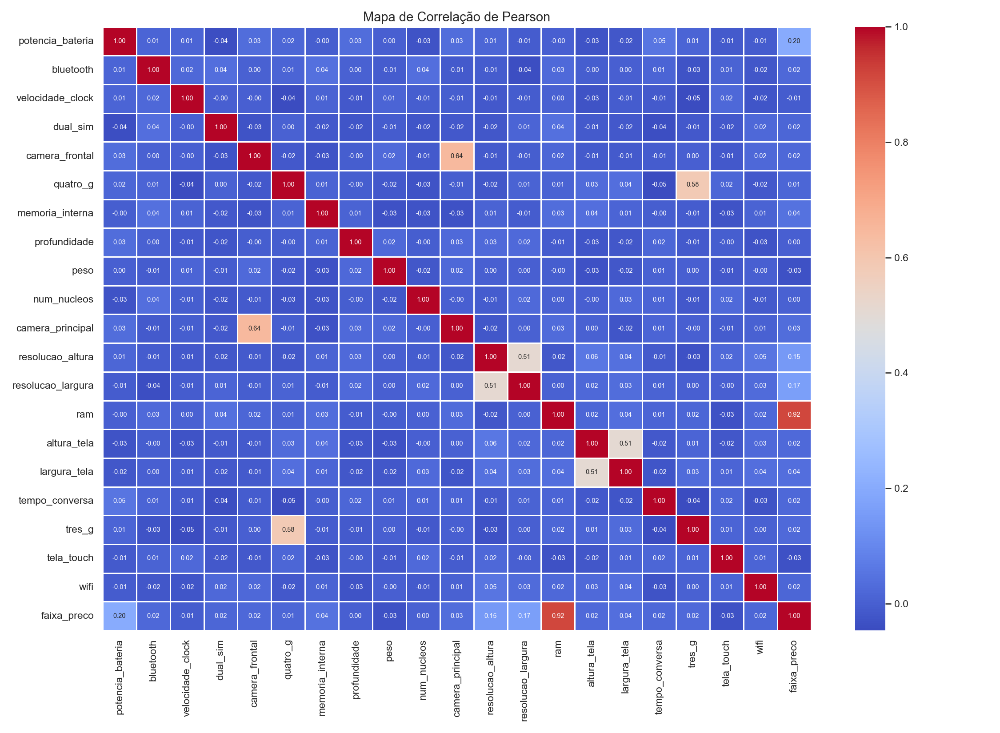
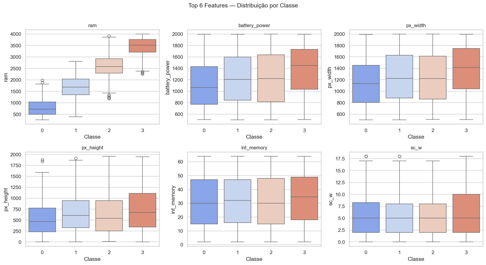
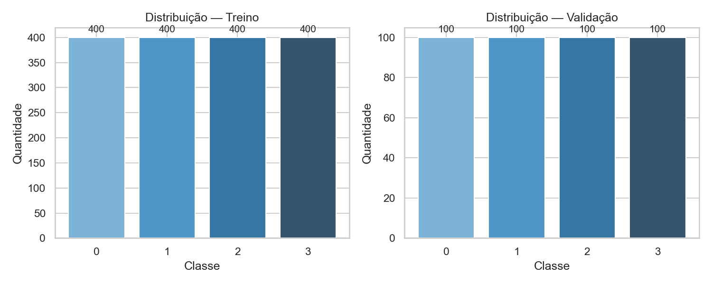

# MobileNet — Mobile Price Range Classification

Classificação de faixa de preço de celulares com rede neural MLP.

---

## Technologies


---

## Problem

Given a set of technical specifications for mobile devices, the goal is to predict the price range (`price_range`) across four categories:

| Class | Description    |
|-------|----------------|
| 0     | Low cost       |
| 1     | Medium cost    |
| 2     | High cost      |
| 3     | Very high cost |

---

## Dataset

| File             | Description                           |
|------------------|---------------------------------------|
| `data/train.csv` | 2000 samples with `price_range` label |
| `data/test.csv`  | Samples for prediction                |

> Data files are not versioned. Add them manually to the `data/` folder.

**Available features (20):** battery power, RAM, front and rear camera, internal memory, depth, weight, number of cores, screen resolution, screen size, talk time, and connectivity (Bluetooth, 4G, 3G, Wi-Fi, dual SIM, touch screen).

---

## Project Structure

```
MobileNet/
├── data/
│   ├── train.csv               # not versioned
│   └── test.csv                # not versioned
├── images/
│   ├── eda/                    # stage 1 — exploratory data analysis
│   ├── training/               # stage 2 — learning curves
│   └── evaluation/             # stage 3-5 — metrics and results
├── mobile_price_mlp.ipynb      # stage 1 — data treatment
├── 02_mlp_implementation.ipynb # stage 2 — MLP implementation
├── requirements.txt
├── .gitignore
└── README.md
```

---

## Setup

```bash
python3 -m venv venv
source venv/bin/activate
pip install -r requirements.txt
jupyter notebook
```

---

## Exploratory Data Analysis

**Target variable distribution**



**Pearson correlation heatmap**



**Top features distribution per class**



**Train / Validation split**



---

## Project Roadmap

### [DONE] Stage 1 — Data Treatment
- CSV loading and inspection
- Exploratory data analysis: dtypes, descriptive statistics, missing values
- Target variable distribution plot
- Pearson correlation heatmap
- Top features boxplots per class
- Normalization with `StandardScaler`
- Train/validation split (80/20, stratified)

### [IN PROGRESS] Stage 2 — MLP Implementation
- Architecture definition (layers, neurons, activation functions)
- Training with `MLPClassifier` from scikit-learn
- Learning curve (loss per epoch)

### [TODO] Stage 3 — Model Evaluation
- Training and validation accuracy
- Confusion matrix
- Classification report (precision, recall, F1-score per class)

### [TODO] Stage 4 — Hyperparameter Tuning
- Grid search or random search
- Parameters: number of layers, neurons, learning rate, regularization
- Results comparison

### [TODO] Stage 5 — Final Results
- Best model selection
- Prediction on test set
- Error analysis and conclusions
